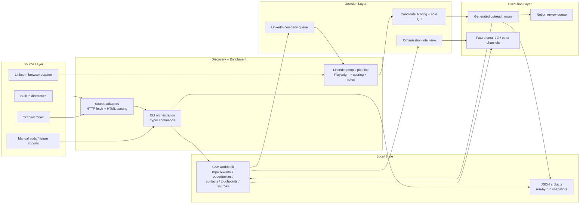
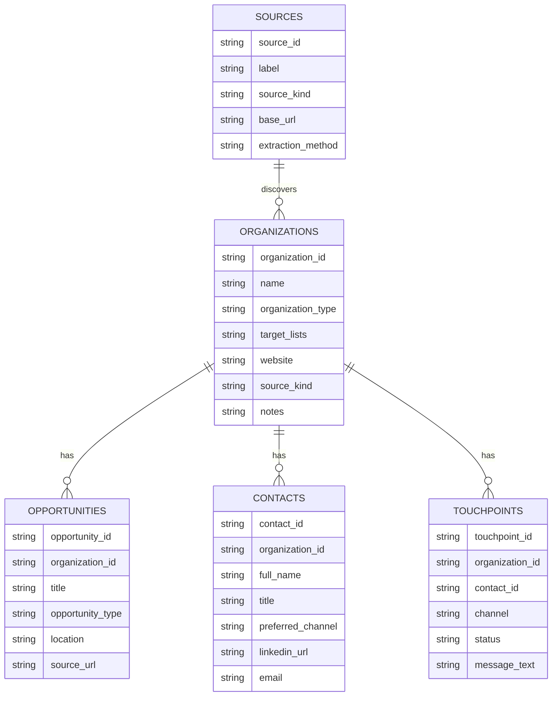
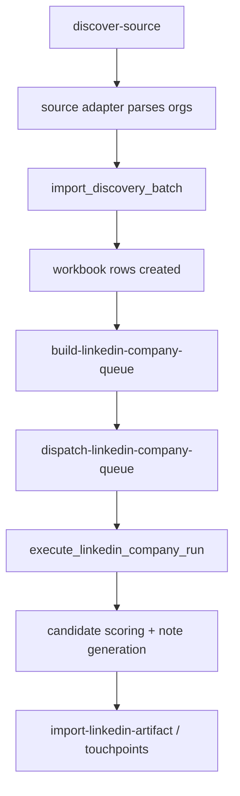
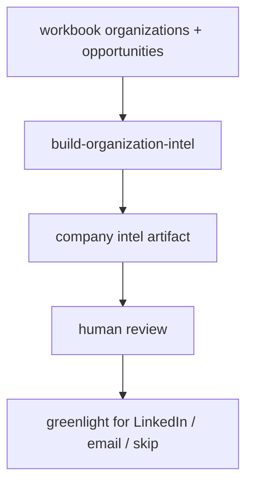

# System Overview

This repo started as a LinkedIn outreach tool. It is now a broader outreach system
with four major layers:

1. discovery from public sources
2. a shared local system of record
3. prioritization and targeting
4. outbound execution and logging

The key shift is that LinkedIn is no longer the whole product. It is now one execution
engine inside a larger pipeline.

## Current Architecture

## Why The System Is Structured This Way

- public-source discovery is fast and cheap when done over HTTP
- LinkedIn requires a real logged-in browser session, so it stays isolated in the
  Playwright layer
- the workbook gives us one entity-first system of record instead of a pile of
  source-specific spreadsheets
- artifacts give us a debuggable audit trail for every run

## Main Components

### 1. Discovery Layer

Implemented in [src/outreach/discovery](/Users/akshat/Desktop/Claude Projects/Outreach/src/outreach/discovery).

What it does:

- registers source definitions
- fetches public listing/detail pages
- parses company metadata
- normalizes results into `DiscoveredOrganization` records

Current sources:

- YC company directories
- Built In company directories

Current extraction modes:

- HTTP fetch + HTML parsing for public startup/company sources
- browser DOM automation only for LinkedIn

### 2. Workbook Layer

Implemented in [src/outreach/tracking.py](/Users/akshat/Desktop/Claude Projects/Outreach/src/outreach/tracking.py).

This is the local source of truth:

- `organizations.csv`
- `opportunities.csv`
- `contacts.csv`
- `touchpoints.csv`
- `sources.csv`

Instead of making a sheet per avenue, the model is entity-first and uses typed fields
plus `target_lists` tags for segmentation.

## Two Kinds Of Stored Output

### Workbook rows

These are the durable business objects we want to track over time:

- which orgs we care about
- who works there
- what opportunities exist
- what messages we drafted or sent

### Artifacts

Implemented in [src/outreach/artifacts.py](/Users/akshat/Desktop/Claude Projects/Outreach/src/outreach/artifacts.py).

These are immutable snapshots of runs:

- discovery runs
- LinkedIn queue builds
- LinkedIn dispatch plans
- dry-run people targeting results
- note batches
- organization intel views

This split matters:

- workbook = current state
- artifact = historical evidence of how we got there

## Execution Paths

### Path A: Startup Discovery To LinkedIn Outreach

### Path B: Organization Review Before Outreach

## What We Pull Today

Depending on source and enrichment depth, the system can already capture:

- company name
- source URL and provenance
- website
- description of what the company does
- tags / categories
- founded year
- team size when exposed
- location
- visible job count
- opportunity titles and apply links
- founders and LinkedIn URLs for YC detail pages
- org-level fit reasoning for Akshat
- recommended next outreach channel

What is still partial today:

- revenue
- funding stage outside what the source directly implies
- public email/contact paths
- leadership/team pages for all sources

## Ranking Layer

There are currently two ranking views:

### 1. LinkedIn Company Queue

Implemented in [src/outreach/cli.py](/Users/akshat/Desktop/Claude Projects/Outreach/src/outreach/cli.py).

Purpose:

- decide which companies to run through the LinkedIn people-finder next

Signals used:

- startup-ness
- hiring signal
- team size
- whether we already have LinkedIn contacts
- source tags like `yc`, `startup`, `built_in`

### 2. Organization Intel

Also implemented in [src/outreach/cli.py](/Users/akshat/Desktop/Claude Projects/Outreach/src/outreach/cli.py).

Purpose:

- let us review companies at the org level before spending time on outreach

Signals surfaced:

- what the company does
- scale clues
- top opportunity titles
- fit score and fit reasons
- recommended first channel

### 3. Target Action Queue

Also implemented in [src/outreach/cli.py](/Users/akshat/Desktop/Claude Projects/Outreach/src/outreach/cli.py).

Purpose:

- separate companies into `apply_now`, `outreach_now`, `review`, or `skip`

Signals used:

- opportunity-title relevance to Akshat's PM/MBA target search
- startup/company fit
- whether outreach has already happened
- whether the org is strong enough for founder/operator outreach even without a posted role

## LinkedIn As A Subsystem

Implemented mainly in [src/outreach/services/linkedin.py](/Users/akshat/Desktop/Claude Projects/Outreach/src/outreach/services/linkedin.py),
[src/outreach/scoring.py](/Users/akshat/Desktop/Claude Projects/Outreach/src/outreach/scoring.py),
and [src/outreach/services/notes.py](/Users/akshat/Desktop/Claude Projects/Outreach/src/outreach/services/notes.py).

This subsystem:

- connects to a real logged-in browser session
- runs multiple people-search passes
- captures candidate rows
- scores them for relevance
- generates short outreach notes
- writes artifacts for review
- can then be imported back into the workbook

That makes LinkedIn a downstream consumer of organization discovery, not the only
entry point anymore.

## Current CLI Surface

The important commands now group into four buckets:

### Discovery

- `list-discovery-sources`
- `discover-source`

### Workbook Management

- `init-workbook`
- `workbook-summary`
- `add-organization`
- `add-opportunity`
- `add-contact`
- `log-touchpoint`

### Prioritization

- `build-linkedin-company-queue`
- `dispatch-linkedin-company-queue`
- `build-organization-intel`

### LinkedIn Execution

- `run`
- `generate-notes`
- `import-linkedin-artifact`

## Practical Mental Model

If you want the shortest mental model for the whole system, it is this:

1. discover organizations from anywhere
2. normalize them into one workbook
3. rank which organizations deserve attention
4. use LinkedIn or another channel to find the right people
5. generate/log touchpoints
6. keep all state and provenance inspectable

## What This Enables Next

Because the architecture is now entity-first and channel-agnostic, we can add:

- more discovery sources without changing the workbook model
- email outreach without building a second tracking system
- USC labs/professors without restructuring storage
- hacker houses, residencies, and incubators as just more org/opportunity sources
- stronger enrichment for scale, funding, and contact intelligence
